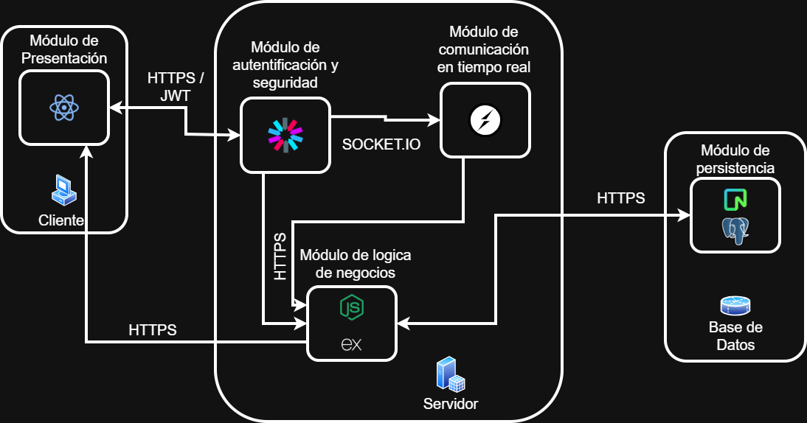
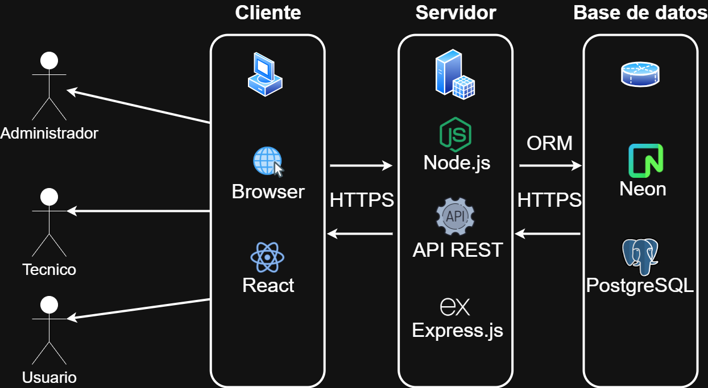
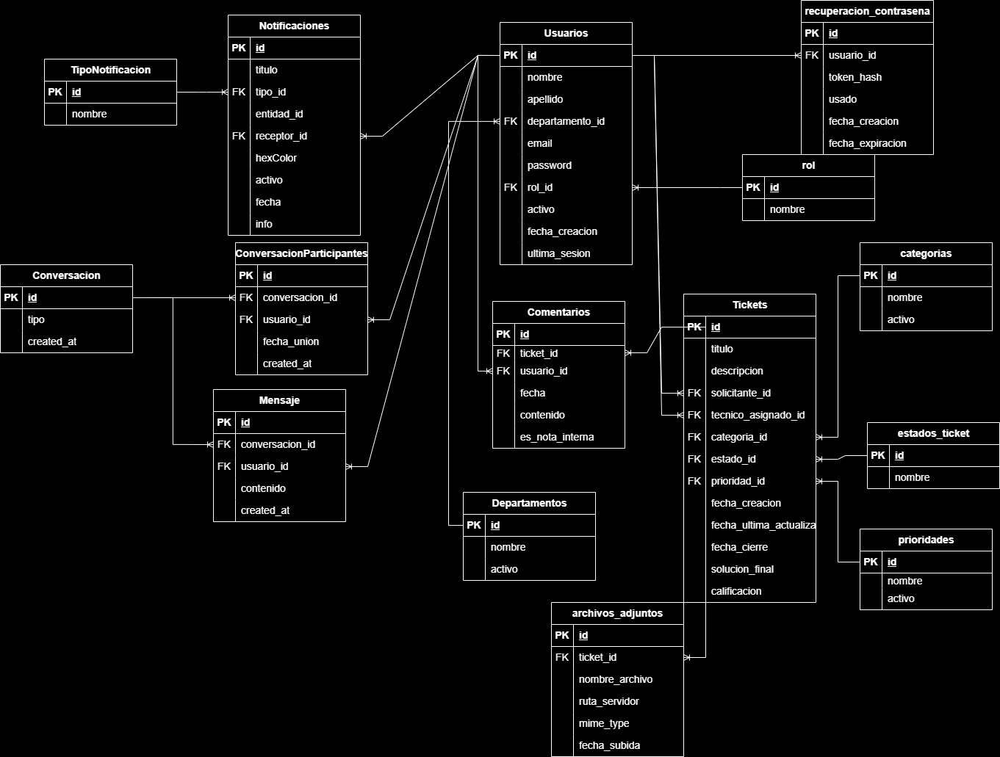
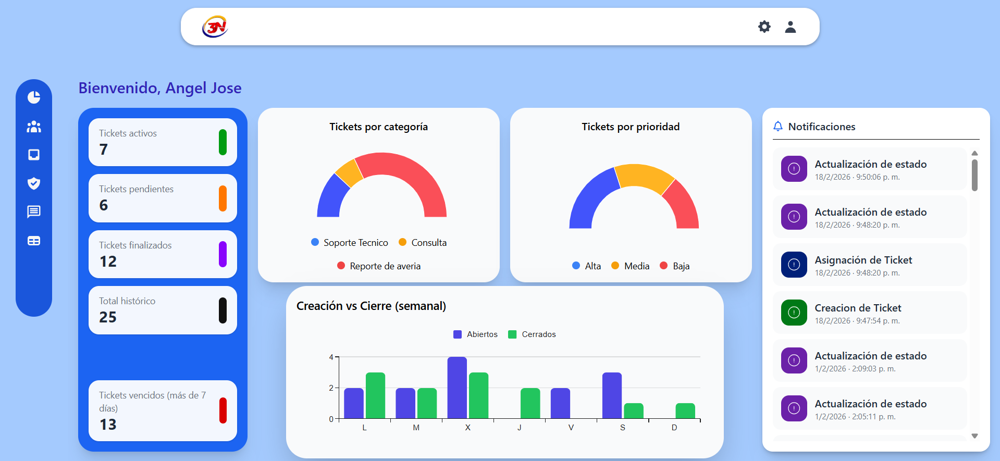
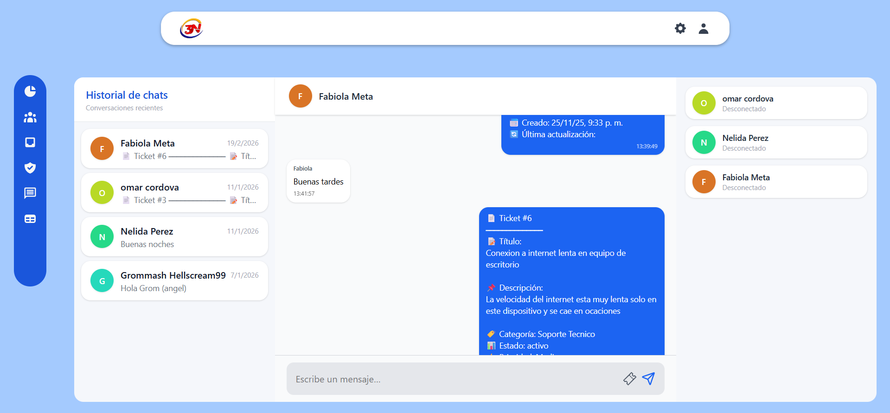
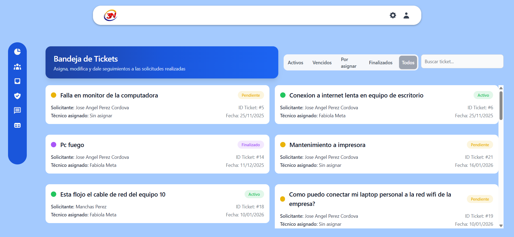
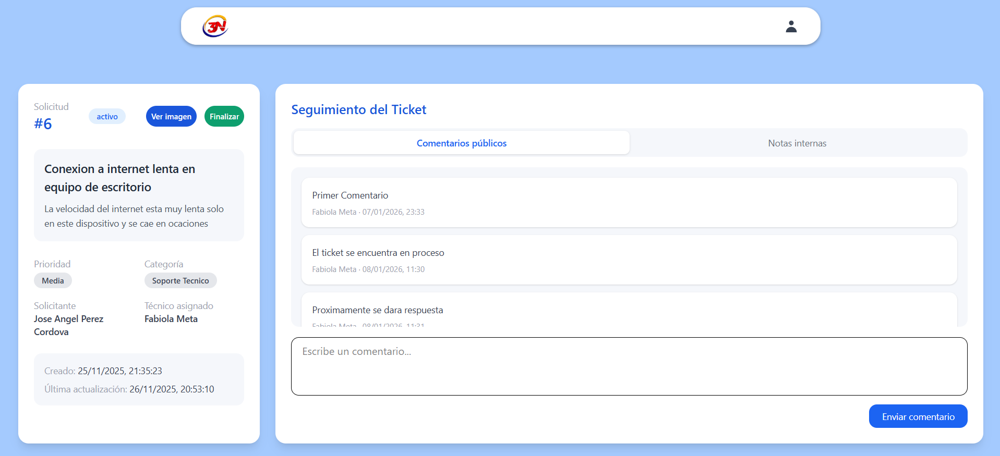

# Incidesk — Sistema de Control y Seguimiento de Solicitudes TI (Helpdesk)

Plataforma web para **registrar, priorizar y dar seguimiento a solicitudes de soporte TI** (tickets), con **roles**, **trazabilidad**, **dashboard de métricas**, **reportes PDF** y **mensajería en tiempo real**.

> Proyecto académico (TSU en Informática) basado en un caso de uso real: centralizar y profesionalizar el flujo de incidencias TI en una organización.

---

## Live demo (pendiente)

- **Live Demo:**  
- **Credenciales de prueba:**  
- **GIF (flujo end-to-end):**  

---

## Qué problema resuelve

En muchas organizaciones, las solicitudes TI se gestionan por canales informales (llamadas, correos, mensajería), lo que genera:

- Pérdida/olvido de requerimientos
- Falta de estatus claro y trazabilidad
- Retrasos, duplicación y mala priorización
- Sin histórico ni métricas para gestión

**Incidesk** centraliza el ciclo de vida del ticket: creación → asignación → atención → cierre → analítica.

---

## Qué construí (resumen técnico)

- **Sistema de tickets** con categorías, prioridades y estados (activo/pendiente/finalizado).
- **Roles y permisos**: Administrador / Técnico / Usuario.
- **Dashboard** con métricas y visualizaciones (tendencias y distribución).
- **Adjuntos** por ticket (evidencias, capturas, documentos).
- **Mensajería privada en tiempo real** (Socket.IO) para coordinación operativa.
- **Notificaciones** dentro del sistema.
- **Reportes PDF** exportables (PDFKit).
- **API REST** + PostgreSQL (Neon) + ORM (Sequelize).

---

## Roles y alcance

- **Administrador**
  - Gestión total del sistema: usuarios, roles, departamentos, categorías.
  - Supervisión global de tickets: asignación/reasignación, cambios de estado, reportes.

- **Técnico**
  - Bandeja de tickets asignados.
  - Registro de avances, comentarios y cierre con solución final.
  - Notas internas (no visibles al usuario final).

- **Usuario (solicitante)**
  - Crear tickets y adjuntar evidencia.
  - Consultar estado e historial de sus solicitudes.

---

## Funcionalidades

### Tickets (core)
- Crear ticket con: título, descripción, categoría, prioridad y adjuntos.
- Estados: **activo / pendiente / finalizado**.
- Historial del ticket para trazabilidad.
- Comentarios:
  - Comentarios visibles al solicitante
  - **Notas internas** (solo técnicos/administración)

### Administración
- CRUD de usuarios + activación/desactivación.
- Gestión de departamentos y categorías.
- Gestión global de tickets (asignación/reasignación y cambios masivos de estado).

### Reportes y analítica
- Dashboard con métricas operativas (por estado/prioridad/categoría, etc.).
- Exportación de reportes a **PDF**.

### Comunicación en tiempo real
- Chat privado para coordinación (Socket.IO).

---

## Arquitectura

Arquitectura **cliente–servidor** en 3 capas:

- **Frontend (SPA):** React + TypeScript + Tailwind
- **Backend (API REST):** Node.js + Express + TypeScript
- **Persistencia:** PostgreSQL (Neon) + Sequelize (ORM)
- **Tiempo real:** Socket.IO

### Diagrama de flujo de datos

### Arquitectura (3 capas)

---

## Modelo de datos

Entidades principales (alto nivel):

- Usuarios, Roles, Permisos
- Departamentos
- Tickets, Categorías, Prioridades, Estados
- Comentarios (incluye notas internas)
- Archivos adjuntos
- Notificaciones
- Conversaciones, Participantes, Mensajes (chat)

### Diagrama ER

---

## Stack técnico

### Frontend
- React + Vite
- TypeScript
- TailwindCSS
- UI/Componentes: MUI, Flowbite (según módulos)
- Gráficas: Chart.js / React-Chartjs-2 / MUI X-Charts
- Realtime: Socket.IO client

### Backend
- Node.js + Express
- TypeScript
- ORM: Sequelize
- DB: PostgreSQL (Neon)
- Auth: JWT
- Hash de contraseñas: bcrypt
- Validación: Joi
- Uploads: Multer
- Reportes: PDFKit
- Realtime: Socket.IO
- Config: dotenv

---

## Seguridad (resumen)

- Autenticación con **JWT**
- Autorización por **roles/permisos** (middlewares)
- Mitigación de SQLi con Sequelize (consultas parametrizadas)
- Mitigación de XSS en UI por escape automático de React
- Manejo controlado de errores (sin filtrar datos internos)

---

## Capturas

## Panel principal de administrador. Notificaciones, estadisticas y metricas utiles

## Modulo de comunicación en tiempo real (Chat online mediante websockets)

## Modulo de gestion de tickets para el administrador

## Atencion de incidencias por tecnicos asignados

